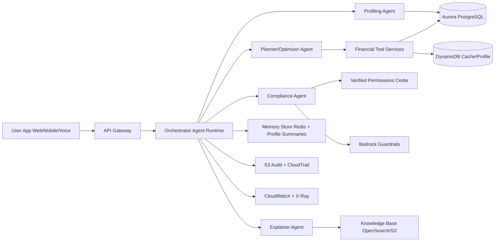

# Personalized Financial Advisory Solutions

## Problem Context
Traditional advisory is expensive, hard to scale, and often biased toward product push. Retail users, especially low-to-middle income segments, need personalized guidance on budgeting, risk, and long-term planning, but face:
- fragmented and incomplete financial data across banks, e-wallets, and investment apps,
- generic recommendations without clear trade-offs,
- low trust due to opaque incentives and poor explainability,
- weak early warning for cashflow stress and unusual spending,
- privacy and scam concerns.

This proposal defines a production-grade **Agentic AI advisory platform** that is personalized, policy-safe, auditable, and cost-efficient at scale.

---

## V. PROJECT REQUIREMENTS & DATA STRATEGY

### A. Functional Requirements (Must-have)

**R1. Onboarding + Profiling + Risk Questionnaire**
- Collect minimum suitability profile: risk tolerance, time horizon, liquidity needs, experience, financial objectives, constraints.
- Build a versioned profile scorecard and confidence score.
- Block plan generation if critical fields are missing.

**R2. Generate Plan + Options + Explanation**
- Generate 1 baseline plan + 2 alternatives (conservative / balanced / growth).
- Include projected cashflow, budget jars, goal feasibility, and downside notes.
- Explain trade-offs in plain language (benefit, risk, affordability impact).

**R3. Suitability / Best-interest Check + Red-flag Triggers**
- Enforce policy constraints before user sees recommendations.
- Trigger warnings for overspending drift, liquidity shortfall, debt stress, unsuitable risk-product mismatch.
- Require explicit user acknowledgment for high-risk options.

**R4. Audit Log Export (Traceable)**
- Export full trace package: prompt summary, tools called, constraints fired, final recommendation rationale.
- Include immutable trace ID and evidence references for each recommendation.

### B. Non-functional Requirements

- **Latency:** p95 `< 8s` for normal advisory chat; p95 `< 20s` for full plan generation.
- **Privacy/Security:** PII minimization, encryption in transit/at rest, least-privilege access, tenant isolation.
- **Auditability:** log prompt metadata, tool calls, policy decisions, fallback reasons, model/tool versions.
- **Reliability:** graceful fallback when tool fails (cached insights + safe explanation + retry path).
- **Scalability:** handle burst traffic (campaign/payday periods) without degradation.
- **Cost control:** tiered model/tool strategy with dynamic routing and budget guards.

### C. Data Strategy

- **Sources**
  - Transaction streams (bank accounts, e-wallets, cards, optional brokerage)
  - User profile + onboarding questionnaire
  - Product facts (fees, eligibility, terms)
  - Market/macroeconomic data (for context, not direct advice truth source)
  - Policy and compliance documents

- **Access & refresh**
  - Real-time/near-real-time for transactions and alerts
  - Daily refresh for profile aggregates, risk snapshots, and product facts
  - Scheduled backfill for reconciliation and late-arriving data

- **Quality controls**
  - Schema contracts + validation on ingest
  - Missing-value and anomaly handling with confidence tags
  - Data lineage and freshness indicators attached to tool outputs

- **Storage model**
  - Operational truth: Aurora PostgreSQL (profiles, plans, transactions, decisions)
  - Event stream: Kinesis/EventBridge + SQS
  - Data lake and audit archive: S3 (versioned, lifecycle + retention policy)
  - Search/vector retrieval: OpenSearch Serverless (policy/docs retrieval)
  - Cache/session: ElastiCache Redis

### D. Suitability / Best-interest Constraints (Policy Box)

> **Policy Box (Mandatory)**
>
> **Required profile fields:**  
> risk tolerance, investment horizon, liquidity needs, investment experience, objectives, user constraints.
>
> **Hard constraints:**  
> 1. Never recommend options above user risk band.  
> 2. No leverage/margin strategy for novice users.  
> 3. Enforce cap on high-volatility allocation (policy-defined threshold).  
> 4. Mandatory fee disclosure and risk disclosure before recommendation confirmation.  
> 5. If profile confidence is low or stale, request clarification before final advice.
>
> **Recommendation output must include:**  
> rationale, alternatives, suitability justification ("why suitable"), and evidence log references.

---

## VI. SOLUTION DESIGN (AGENTIC AI)

### A. Solution Overview (Why Agentic vs Rule-based Robo)
Rule-based robo-advisors mostly map fixed conditions to fixed recommendations. This platform uses an **agentic architecture** that can plan, select tools dynamically, self-check against policy, ask clarifying questions when confidence is low, and output evidence-backed recommendations with full audit traceability. Result: higher personalization quality, safer compliance behavior, and better trust.

### B. Agent Roles & Responsibilities

**Table I. Agents and Tools**

| Agent | Core Responsibility | Typical Tools / Systems |
|---|---|---|
| Orchestrator Agent | Intent routing, plan decomposition, latency/cost-aware execution path | Bedrock model router, tool registry, policy gate, cache |
| Profiling Agent | Build/update suitability profile and profile confidence | profile service, questionnaire engine, risk scoring service |
| Planner/Optimizer Agent | Generate plan options and optimize allocation trade-offs | spend analytics, forecast, recurring detection, goal feasibility, what-if simulator |
| Compliance Agent | Enforce constraints, detect red flags, attach disclosures | Cedar/Verified Permissions, guardrails, policy knowledge base |
| Explainer Agent | User-facing explanation, alternatives, consent capture, next actions | explanation templates, citation retriever, action recommender |

### C. Human-in-the-loop Boundaries

- **User approval required when**
  - recommendation is high-risk or high-volatility,
  - confidence is low / profile incomplete,
  - significant trade-off exists (liquidity vs return vs debt reduction),
  - policy conflict requires explicit acknowledgment.

- **Escalate to advisor/compliance when**
  - recommendation may be unsuitable or borderline,
  - repeated ambiguity after clarification rounds,
  - potential vulnerability/fraud/coercion signals,
  - regulatory-sensitive edge cases.

---

## VII. SYSTEM ARCHITECTURE & WORKFLOW (AWS + Agent Runtime)

### A. End-to-end Flow
`User -> UI -> API Gateway -> Orchestrator Runtime -> Tools/Data Services -> Compliance Check -> Response -> Audit & Monitoring`

Detailed runtime sequence:
1. User submits question or planning request (text/voice).
2. API layer authenticates and enriches request context.
3. Orchestrator routes to profiling/planner/compliance agents.
4. Agents call deterministic financial tools and profile services.
5. Compliance agent enforces hard constraints and disclosures.
6. Explainer agent produces recommendation + alternatives + evidence summary.
7. Response is returned with trace ID; logs, metrics, and policy decisions are stored.

### B. AWS Services (Production Target Stack)

- **LLM/Agent**
  - Amazon Bedrock (multi-model strategy)
  - Agent runtime on ECS Fargate or Bedrock AgentCore Runtime
  - Bedrock Guardrails for safety filtering

- **Orchestration**
  - AWS Step Functions for long-running advisory workflows
  - AWS Lambda for event-driven micro-flows
  - Amazon EventBridge + SQS for resilient async processing

- **API**
  - Amazon API Gateway (+ optional AppSync for real-time app events)

- **Identity**
  - Amazon Cognito (OIDC/JWT)
  - IAM + IAM Identity Center for admin/operator access

- **Data**
  - Aurora PostgreSQL (system of record)
  - DynamoDB (low-latency profile/session lookups)
  - S3 Data Lake (raw + curated + audit export)
  - OpenSearch Serverless (document/vector retrieval)
  - ElastiCache Redis (hot cache, throttling state)

- **Security**
  - AWS KMS (key management)
  - AWS Secrets Manager (credentials/secrets)
  - AWS WAF + Shield (edge protection)
  - AWS Macie + GuardDuty (data/security monitoring)
  - Amazon Verified Permissions (Cedar policies)

- **Logging/Monitoring**
  - CloudWatch Logs/Metrics/Alarms
  - AWS X-Ray + OpenTelemetry traces
  - CloudTrail for API audit

- **Data and ML Ops (recommended)**
  - AWS Glue + Lake Formation for governance and ETL
  - Amazon SageMaker (optional) for model training/monitoring beyond deterministic baseline
  - CodePipeline/CodeBuild for CI/CD

### Fig. 1. System Architecture (Agent runtime + tools + memory + guardrails + logging)

---

## Delivery Phasing (Recommended)

- **Phase 1 (0-8 weeks):** profile onboarding, deterministic tools, compliance gate, traceable logs.
- **Phase 2 (8-16 weeks):** advanced planner options, human escalation workflows, voice advisory.
- **Phase 3 (16+ weeks):** adaptive optimization, deeper partner integrations, continuous policy tuning.

This path balances trust, safety, and personalization while keeping operating cost and compliance risk under control.
