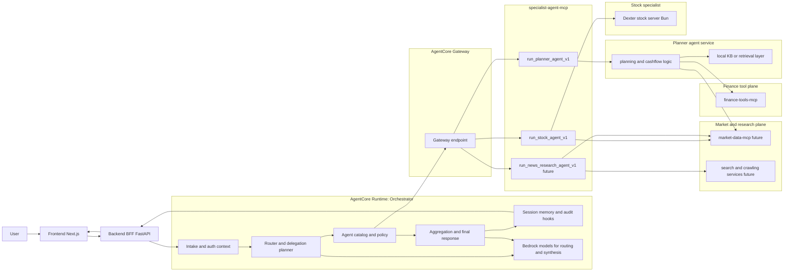
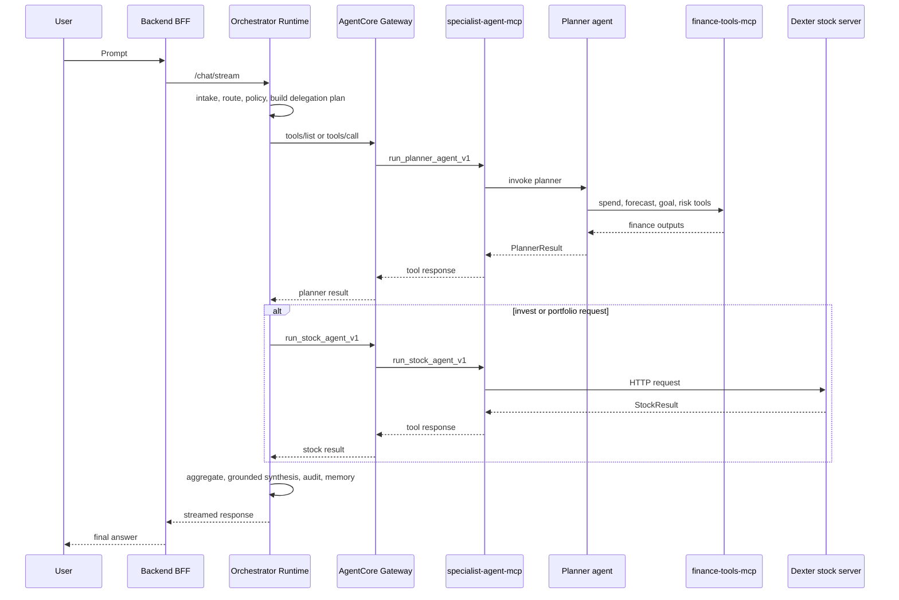
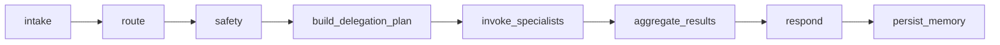
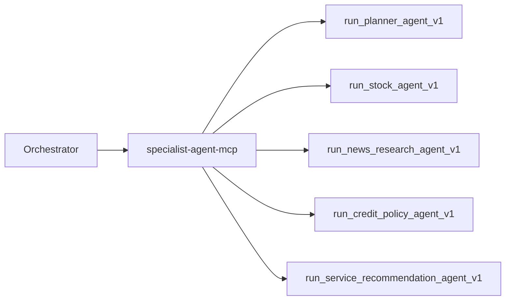

# Multi-Agent Product Architecture Plan

## Goal

Move from the current "single orchestrator + hardcoded stock branch" design to a product-grade architecture with:

- one top-level orchestrator on AgentCore Runtime
- one dedicated `specialist-agent-mcp` plane for agent-as-tool delegation
- separate raw tool planes for finance, market/news, search, and crawling
- clear boundaries for routing, policy, audit, scaling, and future specialist expansion

This document assumes:

- the current financial tool plane already exists as a separate MCP service
- the stock agent already exists as a separate Dexter/Bun server and runs well locally
- the team is willing to refactor code boundaries for long-term scalability

## Why This Migration Is Reasonable

This migration is a good fit for the current repo and product direction for five reasons:

1. The current runtime behaves like a workflow with a hardcoded `planner_internal | stock_external` switch, not a true supervisor with collaborator agents.
2. AWS Bedrock multi-agent guidance favors a supervisor plus clearly scoped collaborators, but Bedrock managed multi-agent currently excludes agents customized with custom orchestration. Since this repo already depends on custom orchestration behavior, a custom orchestrator on AgentCore Runtime is the safer path.
3. AgentCore Runtime is designed to host agents or tools and supports MCP and A2A, so keeping one top-level runtime while moving specialists behind tools is fully aligned with the platform.
4. AgentCore Gateway can expose existing REST APIs and other targets as MCP-compatible tools, which makes the stock Bun server and future specialist services easy to integrate without forcing everything into one runtime.
5. LangChain's subagent pattern and Anthropic's architecture guidance both support the "supervisor calls specialized workers/tools" approach, with the warning to keep the system as simple as possible until specialization is justified.

## Target Architecture

### High-level view



### Request workflow



## Service Boundaries

| Service | Primary responsibility | Should it own user conversation state? | Should it choose raw tools? |
| --- | --- | --- | --- |
| `orchestrator-runtime` | user interaction, routing, policy, delegation, aggregation, final answer, audit | Yes | No, except top-level safety and platform utilities |
| `specialist-agent-mcp` | expose specialist agents as high-level tools with stable schemas | No | No, it should be a thin delegation layer |
| `planner-agent` | planning, cashflow, goals, budget reasoning | No | Yes |
| `stock-agent` | investment-domain synthesis and stock-specific reasoning | No | Yes |
| `finance-tools-mcp` | deterministic finance tools | No | N/A |
| `market-data-mcp` | prices, news, search, crawling, external data | No | N/A |

## Recommended AWS and Service Mapping

| Layer | Recommended implementation |
| --- | --- |
| Orchestrator | AgentCore Runtime HTTP app |
| Specialist agent plane | Custom MCP server, for example `src/aws-specialist-agent-mcp-server/` |
| External tool connectivity | AgentCore Gateway in front of `specialist-agent-mcp` and any other MCP or OpenAPI targets |
| Finance tool plane | existing finance MCP server |
| Stock specialist | existing Dexter Bun server, called by `run_stock_agent_v1` |
| Planner implementation | Python service or shared package called by `run_planner_agent_v1` |
| Session memory and audit | keep at orchestrator |
| Policy | keep top-level policy at orchestrator; optional extra domain checks inside specialists |

## Core Design Rules

### Rule 1: one top-level orchestrator only

The orchestrator is the only user-facing agent. It owns:

- routing
- policy gates
- model selection for routing and final synthesis
- delegation planning
- response aggregation
- memory and audit

This keeps user experience, traceability, and safety centralized.

### Rule 2: specialist agents are exposed as tools

The orchestrator should not hardcode internal business logic for planner or stock. It should call tools such as:

- `run_planner_agent_v1`
- `run_stock_agent_v1`
- `run_news_research_agent_v1`

These tools return structured outputs, not free-form chain-of-thought.

### Rule 3: raw data and deterministic computation stay in tool planes

Not every capability should become an agent.

- deterministic lookup, search, prices, crawling, SQL, and forecasts should stay as tools
- multi-step domain reasoning with its own context window and policy should become an agent

### Rule 4: keep tool depth shallow

Allowed:

- `orchestrator -> specialist-agent-mcp -> planner-agent -> finance-tools-mcp`

Avoid:

- `orchestrator -> agent A -> agent B -> agent C -> tools`

Two layers are manageable for tracing, retries, latency, and operations. Beyond that, failure analysis becomes much harder.

## Why `specialist-agent-mcp` Is Better Than More Hardcoding

This is the main architectural gain:

- the orchestrator no longer needs a growing set of `if intent == X then call Y`
- new specialists become catalog entries plus MCP tools, not graph surgery
- audit becomes cleaner because all delegation has typed tool inputs and outputs
- scaling becomes cleaner because planner, stock, and future specialists can deploy independently
- the stock Bun server can remain its own service while still looking like a standard tool to the orchestrator

## Why Not Put Everything In One MCP

The recommended split is:

- one MCP plane for specialist agents
- separate MCP planes for raw tool domains

This avoids turning one MCP server into a new monolith. The `specialist-agent-mcp` should remain a thin control layer for agent wrappers, not a dumping ground for all domain logic and all data integrations.

## Agent Selection Strategy

Do not let the orchestrator choose subagents directly from a flat tool list only. Add a small agent catalog.

Example catalog fields:

```yaml
- id: planner
  tool_name: run_planner_agent_v1
  domains: [planning, savings, budgeting, goals]
  cost_tier: medium
  latency_class: medium
  safety_class: normal
  parallelizable: true

- id: stock
  tool_name: run_stock_agent_v1
  domains: [investing, portfolio, equity]
  cost_tier: high
  latency_class: medium
  safety_class: elevated
  parallelizable: false
```

The orchestrator should:

1. classify the user request
2. apply deterministic policy constraints
3. query the catalog
4. build a delegation plan
5. invoke one or more specialist tools

This removes hardcoding without giving away all control.

## Recommended Contracts

### `run_planner_agent_v1`

Input:

- normalized prompt
- user profile
- goal context
- session summary
- policy flags
- optional market or research hints

Output:

- summary
- key facts
- recommendations
- citations
- next actions
- tool trace summary
- warnings

### `run_stock_agent_v1`

Input:

- normalized prompt
- risk profile
- liquidity constraints
- planner summary if available
- policy flags

Output:

- summary
- alternatives
- suitability result
- market notes
- citations
- warnings

## Migration Plan

### Phase 0: freeze contracts before moving code

- define `PlannerResult`, `StockResult`, and a shared `AgentResultEnvelope`
- define `agent_catalog.yaml`
- define tool schemas for `run_planner_agent_v1` and `run_stock_agent_v1`

Success criteria:

- all new specialist calls can be validated by schema
- orchestrator can consume specialist outputs without caring about implementation details

### Phase 1: create `specialist-agent-mcp`

Recommended new directory:

- `src/aws-specialist-agent-mcp-server/`

Initial tools:

- `run_planner_agent_v1`
- `run_stock_agent_v1`

Implementation notes:

- `run_stock_agent_v1` calls the existing Dexter Bun server over HTTP
- `run_planner_agent_v1` can initially call shared Python planner code to reduce migration risk

Success criteria:

- orchestrator can call both tools through AgentCore Gateway
- stock no longer needs a special branch inside orchestrator execution logic

### Phase 2: make orchestrator delegate, not execute domain logic

Refactor orchestrator to:

- keep intake, route, policy, memory, audit, and final synthesis
- replace current hardcoded stock selection and direct finance execution with a delegation plan

New graph shape:



Success criteria:

- top-level orchestrator no longer knows planner internals
- top-level orchestrator no longer contains a stock-specific execution branch

### Phase 3: move planner tool selection down into planner agent

Planner becomes responsible for choosing and invoking:

- finance tools
- retrieval
- future market/news tools when relevant

This changes the current control model from:

- `orchestrator -> raw finance tools`

to:

- `orchestrator -> planner agent -> raw finance tools`

Success criteria:

- planner owns planning-domain tool strategy
- orchestrator owns delegation strategy only

### Phase 4: add observability per delegation hop

Add trace fields at every boundary:

- `trace_id`
- `session_id`
- `agent_name`
- `tool_name`
- `request_schema_version`
- `latency_ms`
- `reason_codes`
- `fallback_used`

Success criteria:

- every specialist call is visible in logs and audit
- debugging does not require reading mixed logs from unrelated layers

### Phase 5: scale out with new specialists

After planner and stock stabilize, add specialists only where they provide real isolation or domain skill:

- `run_news_research_agent_v1`
- `run_credit_policy_agent_v1`
- `run_service_recommendation_agent_v1`

Future scale example:



Success criteria:

- adding a new specialist does not require major graph changes
- orchestrator changes are mostly catalog and policy changes

## Suggested Repo Changes

Keep:

- `agent/main.py`
- `agent/orchestrator/`
- `agent/response/`
- `agent/memory/`
- `agent/policy/`

Refactor:

- slim down `agent/graph.py` so it becomes orchestration-centric
- remove direct specialist execution branches from top-level runtime

Add:

- `src/aws-specialist-agent-mcp-server/`
- `agent/subagents/contracts.py`
- `agent/subagents/catalog.py`
- `agent/subagents/selection.py`
- `planner_core/` or another shared package for planner logic

## Decision Rule: Tool or Agent

| Capability | Keep as tool | Promote to agent |
| --- | --- | --- |
| SQL or deterministic analytics | Yes | No |
| search, crawling, raw market data | Yes | Usually no |
| planning that combines many finance tools and context | No | Yes |
| stock advisory synthesis over domain-specific context | No | Yes |
| news reading plus multi-step synthesis and filtering | Maybe | Yes, if it needs its own reasoning loop |

## Operational Benefits

This migration improves:

- scaling: planner, stock, and future specialists can scale independently
- audit: every delegation is a schema-based tool call
- blast radius: one specialist can fail without forcing orchestrator redesign
- deploy flexibility: stock can stay Bun, planner can stay Python
- long-term product velocity: adding a specialist becomes a bounded change

## Risks and Guardrails

Risks:

- too many agent layers
- overusing agents where simple tools are enough
- slow delegation chains
- schema drift between orchestrator and specialists

Guardrails:

- keep one top-level orchestrator only
- keep specialist MCP thin
- use versioned schemas
- cap delegation depth
- require structured outputs from specialists

## External References

The migration approach above is based on the following official or primary references:

- AWS Bedrock multi-agent collaboration explains the supervisor plus collaborator model and emphasizes centralized planning and coordination:
  https://docs.aws.amazon.com/en_us/bedrock/latest/userguide/agents-multi-agent-collaboration.html
- AWS Bedrock multi-agent creation flow recommends creating specialized collaborator agents for specific tasks:
  https://docs.aws.amazon.com/bedrock/latest/userguide/create-multi-agent-collaboration.html
- AWS Bedrock currently excludes supervisor or collaborator agents customized with custom orchestration from managed multi-agent collaboration, which is the key reason to keep this repo on a custom orchestrator:
  https://docs.aws.amazon.com/bedrock/latest/userguide/multi-agents-supported.html
- AWS custom orchestration exists precisely for use cases that need complex, use-case-specific orchestration workflows:
  https://docs.aws.amazon.com/bedrock/latest/userguide/agents-custom-orchestration.html
- AgentCore Runtime is designed to host agents or tools, supports MCP and A2A, and is framework-agnostic and model-flexible:
  https://docs.aws.amazon.com/bedrock-agentcore/latest/devguide/agents-tools-runtime.html
- AgentCore Runtime service contract compares HTTP, MCP, and A2A, which is useful when deciding whether a specialist should be a tool or a standalone agent:
  https://docs.aws.amazon.com/bedrock-agentcore/latest/devguide/runtime-service-contract.html
- AgentCore Gateway can transform existing REST APIs into MCP-compatible tools and can front OpenAPI, Lambda, Smithy, and MCP targets:
  https://docs.aws.amazon.com/bedrock-agentcore/latest/devguide/gateway-building.html
  https://docs.aws.amazon.com/bedrock-agentcore/latest/devguide/gateway-core-concepts.html
- API Gateway stages can be exposed as MCP-compatible tools through AgentCore Gateway, which is relevant if you later wrap specialist services behind API Gateway:
  https://docs.aws.amazon.com/apigateway/latest/developerguide/mcp-server.html
- LangChain's subagent pattern supports a supervisor calling specialized agents as tools, mainly for context isolation and specialization:
  https://docs.langchain.com/oss/python/langchain/multi-agent/subagents
- Anthropic recommends starting with the simplest architecture that works and increasing complexity only when needed, which supports the staged migration path here:
  https://www.anthropic.com/research/building-effective-agents/

## Final Recommendation

For this repo, the best next architecture is:

- one `orchestrator-runtime` on AgentCore Runtime
- one `specialist-agent-mcp` for agent-as-tools
- separate raw tool planes for finance and future market or research tools
- planner moved behind `run_planner_agent_v1`
- stock moved behind `run_stock_agent_v1`
- agent catalog added so the orchestrator selects specialists by metadata and policy, not by hardcoded branching

That gives you a cleaner product architecture now, while preserving a path to future A2A or additional runtimes later if a specialist truly needs to become a first-class standalone agent.
