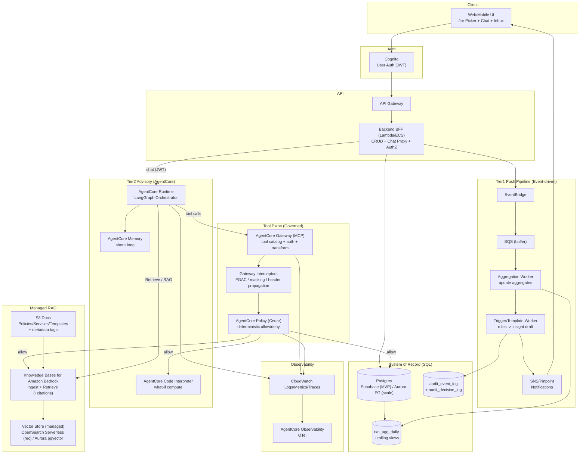
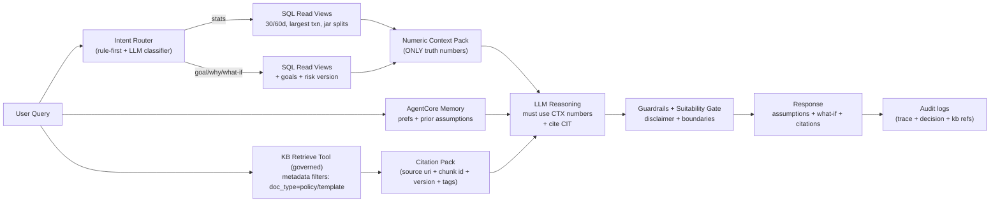
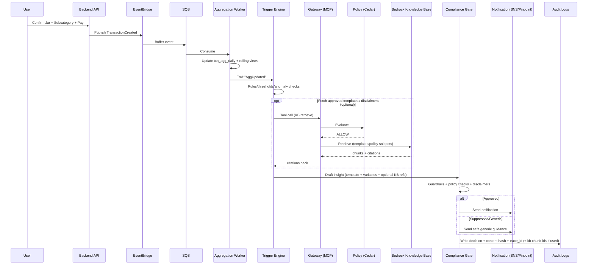
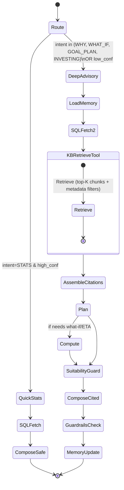
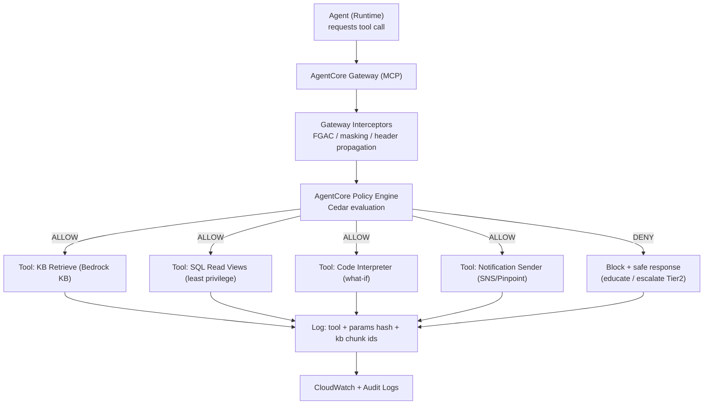

Jars Fintech Banking Simulator + AgentCore Advisory

System restatement (5-7 bullets)
- Web banking simulator (login, transfer requires Jar + Subcategory) + Tier1 inbox.
- Tier2 streaming chat on AgentCore Runtime + LangGraph with citations, disclaimer, trace_id.
- System of record in Postgres (Supabase MVP) -> Aurora PG; numbers must come from SQL.
- KB used only for policy/templates/services, with citations from Bedrock Knowledge Bases.
- Tool plane via AgentCore Gateway (MCP) + Policy/Cedar for deterministic access control.
- Guardrails for PII/prompt attacks + audit trail (trace_id, tool calls, decisions).
- Runtime cannot call localhost; tool endpoints must be public or behind Gateway.

Layer choices (refactor)
| Layer | Choice | Why it fits fintech | Responsibility |
| --- | --- | --- | --- |
| Frontend | Next.js/React (web) / React Native | Jar picker + inbox + chat UX | UI/UX, session id, display citations/disclaimers |
| AuthN (user) | Cognito User Pool (MVP) | Login + JWT tokens | JWT for API, optional JWT for Runtime/Gateway |
| API layer | API Gateway + BFF (Lambda/ECS) | Separates UI from data/agent | CRUD jars/goals/txns, chat streaming proxy |
| Event bus | EventBridge (+ SQS buffer) | Tier1 push event-driven | Route TransactionCreated -> workers |
| Workers | Lambda or ECS Fargate | Scale independently | Aggregates, triggers, notification writer |
| Data of record | Postgres (Supabase MVP) -> Aurora PG | Audit-friendly, authoritative data | Txns, goals, risk versions, audit logs |
| RAG KB | Bedrock Knowledge Bases + OpenSearch Serverless | Managed ingest/retrieve, scale | Chunk/embed, retrieve + citations metadata |
| LLM | Bedrock models (flexible) | AWS sponsor-friendly | Tier1 narrative, Tier2 reasoning |
| Agent runtime | AgentCore Runtime | Session isolation + long-running | Host Tier2 orchestrator (LangGraph) |
| Tool integration | AgentCore Gateway (MCP) + targets | Standardized tools + audit + auth | SQL read, goals, notify, KB retrieve |
| Tool authorization | AgentCore Policy (Cedar) | Deterministic compliance | Allow/deny tool calls by intent/scope |
| Memory | AgentCore Memory | Store summaries/prefs/goals only | Short-term + long-term memory |
| What-if compute | AgentCore Code Interpreter | ETA ranges with assumptions | Sandbox simulation |
| Safety | Bedrock Guardrails | PII/prompt attacks | Input/output filters + disclaimers |
| Observability | CloudWatch + AgentCore OTel | Trace + replay for audit | Logs/metrics/traces |
| IaC | Terraform/CDK (minimal) | Clear path to production | Repeatable deploy (gateway/runtime/roles) |

RAG KB notes
- Data source: S3 (policy/services/templates in md/csv/pdf)
- Vector store: OpenSearch Serverless (AWS-native, scales well)
- Option: Aurora PostgreSQL-Compatible Edition (pgvector) if SQL-only desired
- KB retrieval is served via MCP KB server (open-source) behind AgentCore Gateway

A) Implementation blueprint (MVP)

Repo structure + responsibilities
- frontend/: Next.js + Tailwind, minimal UI, streaming chat, show citations/disclaimer/trace.
- backend/: FastAPI BFF, REST + /chat/stream proxy, JWT auth, EventBridge emit.
- agent/: LangGraph + AgentCore Runtime entrypoint, tool adapters, guard logic.
- workers/: aggregation + trigger + notification writer (Tier1).
- kb/: policy/templates/services corpus + metadata tags.
- iac/: Terraform/CDK skeleton (Runtime/Gateway/Policy/roles/networking).

API endpoints (BFF)
| Method | Path | Purpose | Notes |
| --- | --- | --- | --- |
| POST | /transactions/transfer | Create transfer (jar + category required) | emit TransactionCreated |
| GET | /transactions | list txns (30/60d) | read-only |
| GET | /aggregates/summary | 30/60d summary | SQL view |
| GET | /notifications | inbox list | Tier1 outputs |
| POST | /goals | create/update goal | house goal |
| GET | /risk-profile | current profile | versioned |
| POST | /risk-profile | new version | immutable |
| POST | /chat/stream | stream proxy to AgentCore | SSE |
| GET | /audit/:trace_id | audit record | demo transparency |

Tool catalog (agent tools)
| Tool | Source | Maps to | Purpose |
| --- | --- | --- | --- |
| sql_read_views | BFF/SQL | GET /aggregates/summary | numeric context |
| transactions_list | BFF/SQL | GET /transactions | largest txn, splits |
| goals_get_set | BFF | POST /goals | goals update |
| risk_profile_get | BFF | GET /risk-profile | suitability |
| kb_retrieve | MCP KB server -> Bedrock KB | KB retrieve | citations + governance |
| code_interpreter_run | AgentCore CI | n/a | what-if ETA |
| audit_write | BFF/log | POST /audit | trace + decision |

DB schema (list, key fields)
- users (id, email, created_at)
- profiles (user_id, full_name, locale, risk_level)
- jars (id, user_id, name, target_amount)
- categories (id, parent_id, name, type)
- transactions (id, user_id, jar_id, category_id, amount, counterparty, ts)
- txn_agg_daily (user_id, date, spend, income, jar_spend_json)
- goals (id, user_id, type, target_amount, horizon_months, status)
- risk_profile_versions (id, user_id, risk_score, created_at)
- notifications (id, user_id, type, title, body, created_at, read)
- insights (id, user_id, rule_id, payload_json, created_at)
- income_sources (id, user_id, name, type)
- income_events (id, source_id, amount, ts)
- audit_event_log (trace_id, user_id, event_type, payload_hash, ts)
- audit_decision_log (trace_id, policy_id, decision, reason, ts)

KB corpus structure (S3)
- kb/policies/*.md (no-upsell, suitability, safety)
- kb/templates/*.md (summary templates, disclaimer templates)
- kb/services/*.md (product/service FAQs)
Metadata tags: doc_type=policy|template|service, region=vn, audience=retail

MCP KB server (open-source)
- Deploy MCP server (Docker/ECS/Fargate) with IAM role to call Bedrock KB.
- Register as AgentCore Gateway target.
- Tool signature: retrieve_from_aws_kb(query, knowledgeBaseId, n).

Tier1 pipeline spec
- Event: TransactionCreated (EventBridge)
- Worker A: aggregation update (txn_agg_daily)
- Worker B: triggers (abnormal spend, budget drift, low balance)
- Worker C: format insight template + add disclaimer + write notification + audit
- UI inbox: list notifications sorted by created_at

B) Agent behavior spec

Tier1 (insight generator)
- Template-first; only use KB for approved phrasing/disclaimers.
- No investment advice; include standard disclaimer.

Tier2 (LangGraph routing)
- Router: stats vs goal vs what-if vs risk/suitability.
- Sequence: fetch_context -> kb_retrieve -> (code_interpreter if needed) -> reasoning.
- Citations mandatory when referencing KB.
- Numbers must come from SQL context only.

Risk/Suitability guard
- If intent = invest/buy/sell -> educational guidance only + refusal of advice.
- Always add disclaimer + trace_id.

Memory update
- Store: summaries, preferences, goal metadata.
- Never store: raw ledger rows, PII, full transaction details.

C) Security & compliance

Auth model
- Cognito User Pool JWT.
- Token propagation to tools via Gateway headers.
- Least-privilege scopes enforced by Policy/Cedar.

Prompt injection & PII
- Guardrails on input/output.
- System prompt forbids tool override.
- KB retrieval limited to doc_type=policy|template.
- KB tool routed via Gateway so Policy/Cedar can allow/deny by doc_type and scope.

Audit
- trace_id per request.
- log tool params hash + policy decision.
- store response hash for replay.

D) Hackathon deployment plan

MVP now
- Local frontend/backend + AWS AgentCore Runtime.
- Mock context when backend is localhost (runtime cannot reach local).
- JWT access token flow.

Post-hackathon
- Deploy backend public (API Gateway/Lambda or ECS).
- Move tools to Gateway/MCP + Policy/Cedar.
- Enable Guardrails + Memory + Observability export.

Day-by-day checklist

Day 1 (must have)
- Frontend chat streaming + inbox UI.
- Backend /chat/stream + /aggregates/summary.
- AgentCore Runtime deploy + AccessToken flow.
- Mock context for runtime.

Day 2 (nice to have)
- Tier1 pipeline workers + notifications.
- KB retrieval + citations.
- Basic audit logs + trace_id.

Day 3 (stretch)
- Gateway/MCP + Policy skeleton.
- Guardrails config + Memory summaries.
- Public backend endpoint (replace mock).

1) Backend overview (services + data planes)

Architecture notes
- Gateway turns API/Lambda/services into MCP tools for agents.
- Policy intercepts tool calls and decides allow/deny via Cedar.
- Observability emits OTel to CloudWatch.
- KB retrieval is a governed tool via MCP KB server for audit parity with SQL/compute/notify.

2) Retrieval layer (SQL truth + KB Managed + Memory)

3) Tier1 Push pipeline (Transaction -> Insight -> Notification)

4) Tier2 Agent (LangGraph on AgentCore Runtime)

5) Tool governance layer (Gateway + Policy/Cedar + Audit)

6) Memory layer (short-term vs long-term) + "do not store ledger"

```mermaid
flowchart LR
  subgraph Session["Session (short-term)"]
    S1[Conversation state\ncurrent assumptions]
    S2[Pending scenario\nwhat-if knobs]
  end

  subgraph LongTerm["Long-term Memory"]
    L1[User preferences\nnotification cadence]
    L2[Goal summaries\nhouse horizon band]
    L3[Behavior summaries\noverspend travel pattern]
  end

  Agent[AgentCore Runtime] --> Session
  Agent --> LongTerm

  MWG["Memory Write Guard<br/>(PII/sensitive check)"]:::guard

  Session -. summarize .-> MWG -. store .-> LongTerm

  subgraph NoStore["Do NOT store in memory"]
    X1[Raw transaction ledger]
    X2[Account numbers / IDs / addresses]
    X3[Free-text sensitive notes]
  end
  NoStore -. excluded .- Agent

  classDef guard fill:#fff,stroke:#333,stroke-dasharray: 5 5;
```

