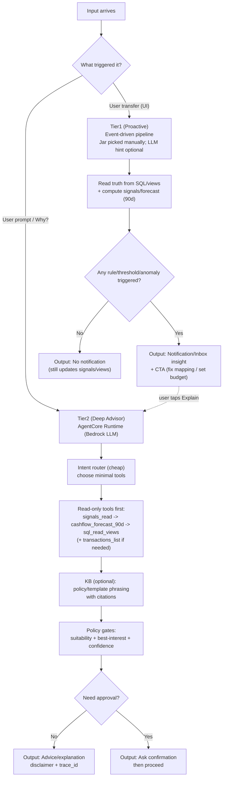
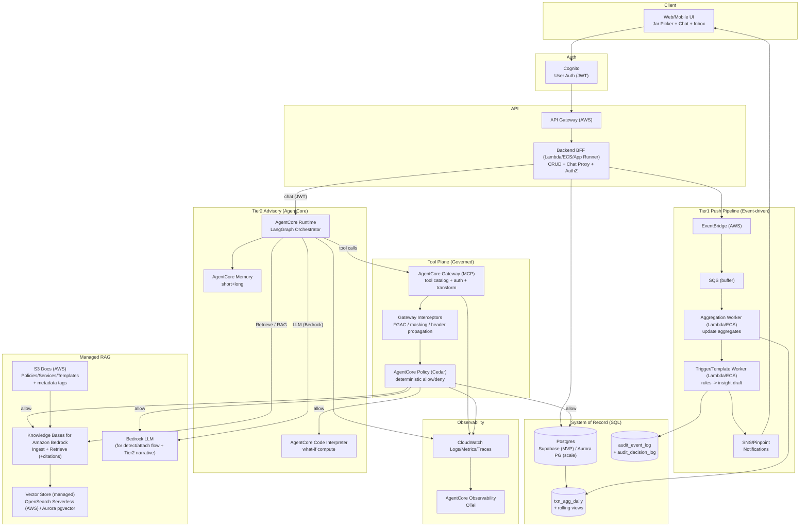
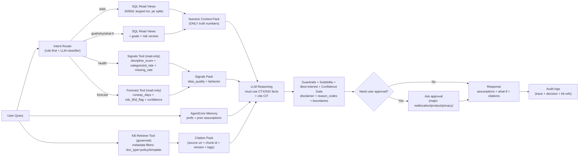
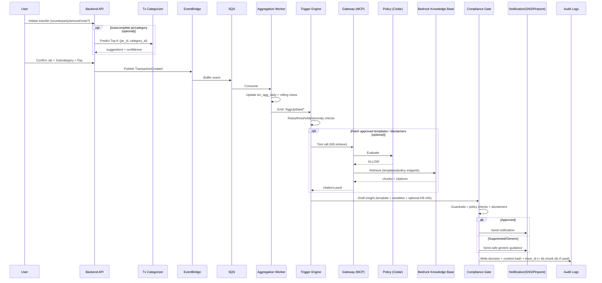
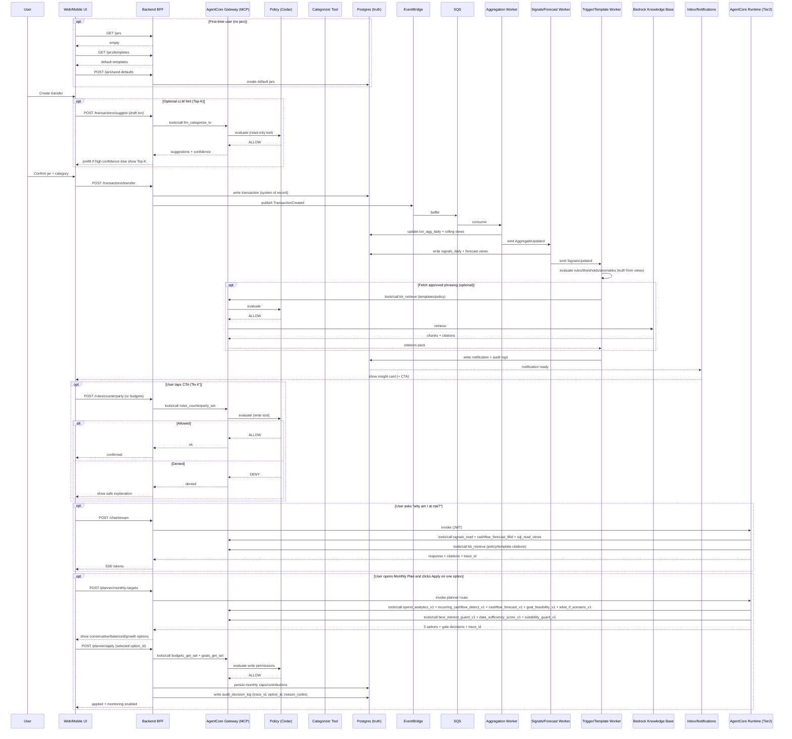
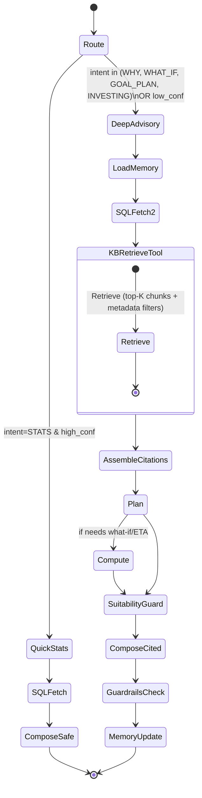
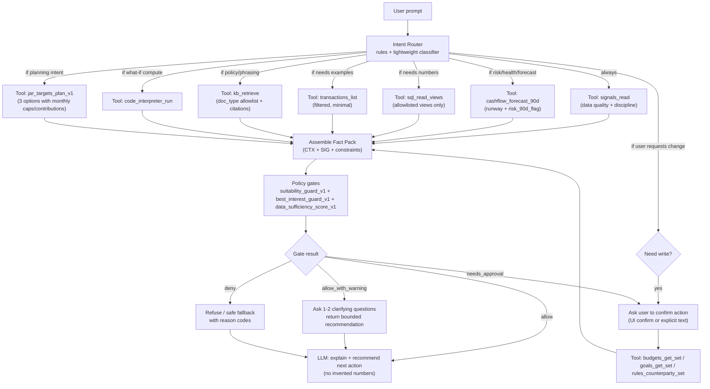
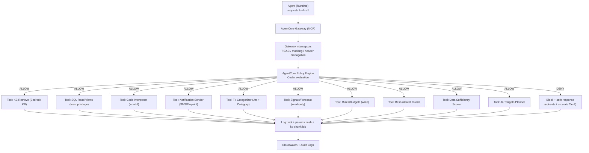

```mermaid
flowchart LR
  subgraph Session["Session (short-term)"]
    S1[Conversation state\ncurrent assumptions]
    S2[Pending scenario\nwhat-if knobs]
  end

  subgraph LongTerm["Long-term Memory"]
    L1[User preferences\nnotification cadence]
    L2[Goal summaries\nhouse horizon band]
    L3[Behavior summaries\noverspend travel pattern]
  end

  Agent[AgentCore Runtime] --> Session
  Agent --> LongTerm

  MWG["Memory Write Guard<br/>(PII/sensitive check)"]:::guard

  Session -. summarize .-> MWG -. store .-> LongTerm

  subgraph NoStore["Do NOT store in memory"]
    X1[Raw transaction ledger]
    X2[Account numbers / IDs / addresses]
    X3[Free-text sensitive notes]
  end
  NoStore -. excluded .- Agent

  classDef guard fill:#fff,stroke:#333,stroke-dasharray: 5 5;
```

Jars Fintech Banking Simulator + AgentCore Advisory

System restatement (5-7 bullets)
- Web banking simulator: Tier1 = user-driven Jar pick in UI (fast transfer UX) with optional LLM Top-K hint; Tier1 insights land in inbox.
- Tier2 = deep advisory chat on AgentCore Runtime + LangGraph with citations, disclaimer, trace_id.
- External/recurring transactions are processed in a separate detect-and-attach flow (`llm_categorize_tx`), not by Tier2 chat.
- System of record in Postgres (Supabase MVP) -> Aurora PG; numbers must come from SQL.
- KB used only for policy/templates/services, with citations from Bedrock Knowledge Bases.
- Tool plane via AgentCore Gateway (MCP) + Policy/Cedar for deterministic access control.
- Guardrails for PII/prompt attacks + audit trail (trace_id, tool calls, decisions).
- Runtime cannot call localhost; tool endpoints must be public or behind Gateway.

Problem & scope focus (report alignment)
- Problem: retail users need monthly financial plans (caps + contributions), not only transaction categorization and static summaries.
- Current gap: jars are operational tags in transfer UX; thresholds exist, but planner-grade monthly targets and 3-option trade-offs are not yet fully productized.
- Who is affected: mass retail users (planning confidence), platform teams (retention/cost-to-serve), compliance (explainability/audit quality).
- Why now: rising cost pressure + AI expectations + stricter transparency requirements.
- In-scope MVP: monthly jar targets, risk-aware 3 options, apply flow to budgets/goals, proactive deviation alerts, suitability+best-interest gates.
- Out-of-scope MVP: trading execution and short-term market timing advice.

Layer choices (refactor)
| Layer | Choice | Why it fits fintech | Responsibility |
| --- | --- | --- | --- |
| Frontend | Next.js/React (web) / React Native | Jar picker + inbox + chat UX | UI/UX, session id, display citations/disclaimers |
| AuthN (user) | Cognito User Pool (MVP) | Login + JWT tokens | JWT for API, optional JWT for Runtime/Gateway |
| API layer | API Gateway + BFF (Lambda/ECS) | Separates UI from data/agent | CRUD jars/goals/txns, chat streaming proxy |
| Event bus | EventBridge (+ SQS buffer) | Tier1 push event-driven | Route TransactionCreated -> workers |
| Workers | Lambda or ECS Fargate | Scale independently | Aggregates, triggers, notification writer |
| Data of record | Postgres (Supabase MVP) -> Aurora PG | Audit-friendly, authoritative data | Txns, goals, risk versions, audit logs |
| RAG KB | Bedrock Knowledge Bases + OpenSearch Serverless | Managed ingest/retrieve, scale | Chunk/embed, retrieve + citations metadata |
| LLM | Bedrock models (flexible) | AWS sponsor-friendly | Tier1 narrative, Tier2 reasoning |
| Agent runtime | AgentCore Runtime | Session isolation + long-running | Host Tier2 orchestrator (LangGraph) |
| Tool integration | AgentCore Gateway (MCP) + targets | Standardized tools + audit + auth | SQL read, signals/forecast, categorize, rules/budgets, goals, notify, KB retrieve |
| Tool authorization | AgentCore Policy (Cedar) | Deterministic compliance | Allow/deny tool calls by intent/scope |
| Memory | AgentCore Memory | Store summaries/prefs/goals only | Short-term + long-term memory |
| What-if compute | AgentCore Code Interpreter | ETA ranges with assumptions | Sandbox simulation |
| Anomaly detection | River (ADWIN) + PyOD (ECOD) | Streaming drift + outlier detection | Real-time transaction monitoring |
| Change point detection | Ruptures (Pelt) | Offline structural break detection | Income/spend pattern shifts |
| Forecasting | Darts (ExponentialSmoothing) + statsmodels | Deterministic, auditable time series | Cashflow projection, runway estimates |
| Safety | Bedrock Guardrails | PII/prompt attacks | Input/output filters + disclaimers |
| Observability | CloudWatch + AgentCore OTel | Trace + replay for audit | Logs/metrics/traces |
| Experimentation + KPI | AppConfig Feature Flags + EventBridge + Firehose + S3 + Athena + QuickSight | Measure impact safely in fintech | Variant assignment, event logging, KPI dashboards |
| IaC | Terraform/CDK (minimal) | Clear path to production | Repeatable deploy (gateway/runtime/roles) |

RAG KB notes
- Data source: S3 (policy/services/templates in md/csv/pdf)
- Vector store: OpenSearch Serverless (AWS-native, scales well)
- Option: Aurora PostgreSQL-Compatible Edition (pgvector) if SQL-only desired
- KB retrieval is served via MCP KB server (open-source) behind AgentCore Gateway
- Decision lock for current phase: keep OpenSearch in tech stack (no platform swap); optimize algorithm layer only.

Current implementation snapshot (Tier2 agent, as-built)
- Entrypoint remains `POST /chat/stream` (SSE), no external API changes.
- Encoding gate is now placed before semantic router:
  - deterministic `detect -> repair -> fail_fast`
  - normalized Unicode prompt (default `NFC`)
  - fail-fast short-circuits routing/tool calls to prevent wrong intent mapping
- Routing is semantic-first:
  - Bedrock structured extraction (`intent_extraction_v1`)
  - deterministic planner policy (`router/policy.py`)
  - clarifying questions (1-2 MCQ) when confidence/slots are insufficient
- Service suggestion uses dynamic matching (algorithm upgrade, stack unchanged):
  - catalog-driven matching from `kb_index.csv` + service metadata
  - context signal layer from tool facts (cashflow/anomaly/goal/risk)
  - hybrid scoring (intent + signals + facts + semantic similarity + policy constraints)
  - low-margin clarification for ambiguous top-2 service candidates
- Tool execution is policy-bundle based (no keyword branch routing in runtime path):
  - `summary` -> spend + forecast + jar allocation
  - `risk` -> spend + anomaly + risk profile
  - `planning` -> spend + forecast + recurring + goal + jar allocation
  - `scenario` -> what-if scenario
  - `invest` -> suitability guard + risk profile (education-only)
  - `out_of_scope` -> suitability guard
- Planned global policy gates (next): `suitability_guard_v1` + `best_interest_guard_v1` + `data_sufficiency_score_v1` before final rendering/write actions.
- Response generation is LLM-grounded:
  - `facts -> advisory_context (insights/actions) -> answer_plan_v2 -> grounding validator -> renderer`
  - renderer binds placeholders `[F:fact_id]` to verified facts.
- In `RESPONSE_MODE=llm_enforce`, fallback is `facts_only_compact_renderer`; legacy intent templates are not used for normal enforce responses.
- Audit payload now includes `routing_meta`, `response_meta`, `evidence_pack`, `advisory_context`, `answer_plan_v2`.

Current product gap (report alignment)
- Jars in UX are still primarily tagging/categorization anchors in transfer flow; they are not yet a first-class monthly planning contract.
- `jar_allocation_suggest_v1` provides split guidance from spending profile, but this is not equivalent to explicit monthly jar caps/contribution targets in absolute VND.
- Data model already has `jars.target_amount` and `budgets(period, limit_amount, scope_*)`, but current described flow is still threshold/alert-centric, not a full planner loop with 3-option trade-offs and one-click plan apply.

A) Implementation blueprint (MVP)

Related docs
- `README.md` (local run + deploy notes)
- `backend/docs/api.md` (API contracts)
- `backend/docs/schema.md` (schema design)
- `model_data_train.md` (model + data training plan)
- `src/aws-kb-retrieval-server/README.md` (MCP server)

Repo structure + responsibilities
- frontend/: Next.js + Tailwind, minimal UI, streaming chat, monthly plan screen (3-option apply), show citations/disclaimer/trace.
- backend/: FastAPI BFF, REST + /chat/stream proxy, JWT auth, EventBridge emit.
- agent/: LangGraph + AgentCore Runtime entrypoint, tool adapters, guard logic.
- src/aws-finance-mcp-server/: standalone Finance MCP service (JSON-RPC /mcp) for deterministic SQL-first advisory tools.
- workers/: aggregation + trigger + notification writer (Tier1).
- kb/: policy/templates/services corpus + metadata tags.
- iac/: Terraform/CDK skeleton (Runtime/Gateway/Policy/roles/networking).

API endpoints (BFF)
| Method | Path | Purpose | Notes |
| --- | --- | --- | --- |
| POST | /transactions/transfer | Create transfer (jar + category required) | emit TransactionCreated |
| POST | /transactions/suggest | Suggest jar + category | LLM tool (`llm_categorize_tx`) with confidence gating; auto-select only if high confidence |
| GET | /transactions | list txns (30/60d) | read-only |
| GET | /aggregates/summary | 30/60d summary | SQL view |
| GET | /notifications | inbox list | Tier1 outputs |
| GET | /jars | list jars | user-defined jars (name/description/keywords) |
| POST | /jars | create jar | improves categorization + personalization |
| GET | /jars/templates | list default jar templates | seed on first use |
| POST | /jars/seed-defaults | create default jars for user | one-time init |
| GET | /signals/summary | data-quality + behavior signals | % categorized, missing data, discipline score |
| GET | /forecast/cashflow | cashflow forecast | include 90d runway + confidence |
| POST | /rules/counterparty | map counterparty -> jar/category | "1-click fix" action from insights |
| GET | /budgets | list budgets | jar/category thresholds for Tier1 |
| POST | /budgets | set budget | CTA: set/adjust thresholds |
| POST | /goals | create/update goal | house goal |
| POST | /planner/monthly-targets (planned) | generate monthly plan options | returns conservative/balanced/growth with caps+contributions |
| POST | /planner/apply (planned) | apply selected plan option | persists to `/budgets` + `/goals` with trace_id |
| GET | /risk-profile | current profile | versioned |
| POST | /risk-profile | new version | immutable |
| POST | /chat/stream | stream proxy to AgentCore | SSE |
| GET | /audit/:trace_id | audit record | demo transparency |

Tool catalog (agent tools)
Training & data plan: see `model_data_train.md`.

| Tool | Source | Maps to | Purpose |
| --- | --- | --- | --- |
| sql_read_views | BFF/SQL | GET /aggregates/summary | numeric context |
| transactions_list | BFF/SQL | GET /transactions | largest txn, splits |
| llm_categorize_tx | LLM tool | POST /transactions/suggest | suggest jar + subcategory (Top-K + confidence, no training) |
| signals_read | BFF/SQL | GET /signals/summary | data quality + behavior signals |
| cashflow_forecast_90d | BFF/SQL | GET /forecast/cashflow | runway + 90d cashflow risk |
| rules_counterparty_set | BFF | POST /rules/counterparty | persist mapping for messy data |
| budgets_get_set | BFF | POST /budgets | set thresholds for proactive alerts |
| goals_get_set | BFF | POST /goals | goals update |
| risk_profile_get | BFF | GET /risk-profile | suitability |
| kb_retrieve | MCP KB server -> Bedrock KB | KB retrieve | citations + governance |
| code_interpreter_run | AgentCore CI | n/a | what-if ETA |
| audit_write | BFF/log | POST /audit | trace + decision |
| spend_analytics_v1 | Finance MCP | tools/call | deterministic spend/income/net summary |
| anomaly_signals_v1 | Finance MCP | tools/call | anomaly flags (River ADWIN drift, PyOD ECOD outliers, Ruptures Pelt change points) |
| cashflow_forecast_v1 | Finance MCP | tools/call | short-horizon cashflow projection bands |
| jar_allocation_suggest_v1 | Finance MCP | tools/call | jar split recommendations from spending profile |
| risk_profile_non_investment_v1 | Finance MCP | tools/call | non-investment risk scoring + runway context |
| suitability_guard_v1 | Finance MCP | tools/call | compliance guard for invest/execution intents |
| recurring_cashflow_detect_v1 | Finance MCP | tools/call | detect recurring/fixed costs + drift alerts |
| goal_feasibility_v1 | Finance MCP | tools/call | evaluate savings goal feasibility + gap |
| what_if_scenario_v1 | Finance MCP | tools/call | compare multiple scenario variants deterministically |
| jar_targets_plan_v1 (planned) | Finance MCP | tools/call | build monthly jar caps + contributions across 3 options |
| best_interest_guard_v1 (planned) | Finance MCP | tools/call | liquidity/affordability/risk-alignment/conflict checks with reason codes |
| data_sufficiency_score_v1 (planned) | Finance MCP | tools/call | score data quality/completeness and gate recommendation depth |
| tradeoff_plan_builder_v1 (planned) | Finance MCP | tools/call | generate conservative/balanced/growth options with ETA and risk trade-offs |

Finance MCP tools currently implemented (`src/aws-finance-mcp-server`)
- Core 6 tools: `spend_analytics_v1`, `anomaly_signals_v1`, `cashflow_forecast_v1`, `jar_allocation_suggest_v1`, `risk_profile_non_investment_v1`, `suitability_guard_v1`.
- Extended 3 tools: `recurring_cashflow_detect_v1`, `goal_feasibility_v1`, `what_if_scenario_v1`.
- All 9 tools return the same audit envelope: `trace_id`, `version`, `params_hash`, `sql_snapshot_ts`, `audit`.
- **Anomaly detection stack**: River ADWIN (streaming drift), PyOD ECOD (outliers), Ruptures Pelt (change points - replaces Kats CUSUM due to dependency conflicts).
- Planned next tools for report alignment: `jar_targets_plan_v1`, `best_interest_guard_v1`, `data_sufficiency_score_v1`, `tradeoff_plan_builder_v1`.

DB schema (list, key fields)
- users (id, email, created_at)
- profiles (user_id, full_name, locale, risk_level)
- jar_templates (id, name, description, keywords_json, is_default, created_at)
- jars (id, user_id, template_id, name, description, keywords_json, target_amount)
- categories (id, parent_id, name, type)
- transactions (id, user_id, jar_id, category_id, amount, currency, counterparty, raw_narrative, user_note, channel, ts)
- rules_counterparty_map (id, user_id, counterparty_norm, jar_id, category_id, created_at)
- budgets (id, user_id, scope_type, scope_id, period, limit_amount, currency, created_at, updated_at, active)
- tx_label_events (id, user_id, txn_id, model_version, suggested_topk_json, final_jar_id, final_category_id, is_override, created_at)
- signals_daily (id, user_id, day, discipline_score, categorized_rate, missing_rate, runway_days, risk_90d_flag, payload_json)
- txn_agg_daily (user_id, date, spend, income, jar_spend_json)
- goals (id, user_id, type, target_amount, horizon_months, status)
- risk_profile_versions (id, user_id, risk_score, created_at)
- notifications (id, user_id, type, title, body, created_at, read)
- insights (id, user_id, rule_id, payload_json, created_at)
- income_sources (id, user_id, name, type)
- income_events (id, source_id, amount, ts)
- audit_event_log (trace_id, user_id, event_type, payload_hash, ts)
- audit_decision_log (trace_id, policy_id, decision, reason, ts)

KB corpus structure (S3)
- kb/policies/*.md (no-upsell, suitability, safety)
- kb/templates/*.md (summary templates, disclaimer templates)
- kb/services/*.md (product/service FAQs)
Metadata tags: doc_type=policy|template|service, region=vn, audience=retail

MCP KB server (open-source)
- Deploy MCP server (Docker/ECS/Fargate) with IAM role to call Bedrock KB.
- Register as AgentCore Gateway target.
- Tool signature: retrieve_from_aws_kb(query, knowledgeBaseId, n).

Tier1 pipeline spec
- Event: TransactionCreated (EventBridge)
- Worker A: aggregation update (txn_agg_daily)
- Worker B: signals/forecast compute (runway/90d risk, discipline, missing data)
- Worker C: triggers (rules/thresholds/anomaly) + format insight template + add disclaimer + write notification + audit
- Planned extension: deviation monitor compares actual month-to-date vs applied monthly caps/contributions from `budgets`/`goals`.
- UI inbox: list notifications sorted by created_at
- User-facing UX: transfer flow is **manual jar pick**; optional `llm_categorize_tx` gives Top-K hint; low confidence -> user must choose.

B) Agent behavior spec

Tier1 (insight generator)
- Template-first; only use KB for approved phrasing/disclaimers.
- No investment advice; include standard disclaimer.
- Prefer actionable outputs (CTA) when possible (set rule / recategorize / set budget).
- Low-confidence categorization must not auto-apply; require user confirmation.

Tier2 (LangGraph routing)
- Router: semantic extraction (`intent_extraction_v1`) + deterministic planner policy.
- Clarify gates (default):
  - intent confidence < 0.70 or top2 gap < 0.15 -> clarify
  - scenario confidence < 0.75 or missing horizon/delta slots -> clarify
- Tool execution is bundle-driven from route decision (not keyword branch if/else).
- Reasoning sequence:
  - `build_evidence_pack`
  - `build_advisory_context` (deterministic insights + action candidates)
  - LLM synthesize `answer_plan_v2` (JSON schema)
  - grounding/compliance validation (fact/insight/action IDs + placeholder binding)
  - renderer (`Tom tat 3 dong`, `So lieu chinh`, `Khuyen nghi hanh dong`, `Gia dinh va han che`, `Disclaimer`)
- In `llm_enforce`, fallback uses `facts_only_compact_renderer` when synthesis/validation fails.
- Numbers shown to user must be grounded to tool facts; response metadata stores fallback/validation reason codes.

Goal Planner + Monthly Jar Targets (planned MVP)
- Purpose: convert jar guidance from "categorization/tagging" into a concrete monthly plan with persistable targets.
- Monthly target types:
  - spending caps: category/jar caps for monthly spending (`food`, `transport`, `entertainment`, etc.).
  - contribution targets: monthly savings into goal jars (`emergency`, `house`, etc.).
- Planner build path (Tier2):
  1. read context: `spend_analytics_v1`, `recurring_cashflow_detect_v1`, `cashflow_forecast_v1`, `goal_feasibility_v1`, `what_if_scenario_v1`, `risk_profile_non_investment_v1`
  2. generate 3 options (`conservative`, `balanced`, `growth`) with absolute VND caps/contributions
  3. run gates: `suitability_guard_v1` + `best_interest_guard_v1` + `data_sufficiency_score_v1`
  4. if approved by user, persist selected option to `budgets_get_set` (`period=month`, `scope_type=jar|category`) + `goals_get_set`
  5. emit audit record with `trace_id`, option_id, applied targets, gate decision, reason_codes
- Monitoring linkage (Tier1):
  - Tier1 compares real spend/income vs applied monthly targets.
  - Trigger deviation alerts and corrective CTAs when cap/contribution drift is detected.

Tier2 runtime flags (current)
- `ROUTER_MODE=rule|semantic_shadow|semantic_enforce`
- `ROUTER_POLICY_VERSION=v1`
- `ROUTER_INTENT_CONF_MIN=0.70`
- `ROUTER_TOP2_GAP_MIN=0.15`
- `ROUTER_SCENARIO_CONF_MIN=0.75`
- `ROUTER_MAX_CLARIFY_QUESTIONS=2`
- `RESPONSE_MODE=template|llm_shadow|llm_enforce`
- `RESPONSE_PROMPT_VERSION=answer_synth_v2`
- `RESPONSE_SCHEMA_VERSION=answer_plan_v2`
- `RESPONSE_POLICY_VERSION=advice_policy_v1`
- `RESPONSE_MAX_RETRIES=1`
- `ENCODING_GATE_ENABLED=true`
- `ENCODING_REPAIR_ENABLED=true`
- `ENCODING_REPAIR_SCORE_MIN=0.12`
- `ENCODING_FAILFAST_SCORE_MIN=0.45`
- `ENCODING_REPAIR_MIN_DELTA=0.10`
- `ENCODING_NORMALIZATION_FORM=NFC`
- `SERVICE_MATCHER_MODE=static|dynamic|dynamic_v2`
- `SERVICE_MATCH_TOP_K=3`
- `SERVICE_MATCH_MIN_SCORE=0.58`
- `SERVICE_CATALOG_STRICT_VALIDATION=true`
- `SERVICE_SIGNAL_REQUIRED_STRICT=true`
- `SERVICE_CLARIFY_MARGIN_MIN=0.08`
- `SERVICE_EMBED_ENABLED=true`
- `SERVICE_EMBED_MODEL_ID=amazon.titan-embed-text-v2:0`
- `SERVICE_EMBED_TOP_N=8`
- Compatibility note: `ROUTER_MODE=rule` is currently coerced to semantic runtime path (safe default).

Risk/Suitability guard
- If intent = invest/buy/sell -> educational guidance only + refusal of advice.
- Always add disclaimer + trace_id.

Trade-off decision policy matrix (planned)

The advisor returns exactly 3 options (`conservative`, `balanced`, `growth`) with explicit trade-offs on liquidity, goal ETA, and risk.

| Plan profile | Entry conditions (dominant signals) | Allocation bias (example) | Expected trade-off |
| --- | --- | --- | --- |
| Conservative | runway `< 3` months OR volatility `>= 0.40` OR overspend `>= 0.35` | Essentials+Debt+Emergency `>= 75%`, Goals `15-20%`, Growth `0-5%` | Highest safety, slowest goal speed |
| Balanced | runway `3-6` months AND volatility `0.20-0.40` AND overspend `0.15-0.35` | Essentials+Debt+Emergency `60-70%`, Goals `20-30%`, Growth `5-10%` | Middle path on safety vs progress |
| Growth | runway `>= 6` months AND volatility `< 0.20` AND overspend `< 0.15` | Essentials+Debt+Emergency `50-60%`, Goals `25-35%`, Growth `10-20%` | Fastest goal speed, lower liquidity buffer |

Selection rule (planned)
- Use worst-signal-wins gating: if any high-risk signal fires, cap to `conservative`.
- Never output only one plan for planning/scenario intents; always output 3 and explain trade-off.

Trade-off 3 Options Output Contract (v1, planned)
- For `planning` and `scenario` intents, response must include exactly 3 options: `conservative`, `balanced`, `growth`.
- Output shape per option:

```json
{
  "option_id": "conservative|balanced|growth",
  "jar_caps": {
    "food": 0,
    "transport": 0,
    "entertainment": 0
  },
  "jar_contributions": {
    "emergency": 0,
    "goal_house": 0
  },
  "goal_eta_days_or_months": 0,
  "runway_days": 0,
  "overspend_risk_flag": true,
  "tradeoff_summary": "1-2 sentence summary of liquidity vs speed vs risk.",
  "who_it_fits": "User profile that this option best matches.",
  "actions_to_apply": [
    {
      "tool": "budgets_get_set|goals_get_set",
      "payload_ref": "targets in this option"
    }
  ]
}
```

Contract rules
- Numeric values must be grounded by SQL/tool outputs (or explicitly marked as demo placeholders).
- No invest execution actions in MVP; education-only remains enforced.
- `Apply` writes monthly targets using `budgets_get_set` and goal contributions/horizon updates using `goals_get_set`.

HITL approval matrix (planned)

| Action | Risk level | Default mode | Threshold / trigger | Output |
| --- | --- | --- | --- | --- |
| Recategorize txn, set mapping rule, adjust budget <= 10% | Low | Auto | policy allow + data sufficiency >= 0.60 | Execute + log + undo CTA |
| Jar reallocation > 15% OR monthly contribution delta > 20% | Medium | Confirm | user approval required | Confirm dialog + rationale |
| Product/service recommendation (deposit/loan/card) | Medium-High | Confirm | disclosure + best-interest pass | Recommendation + approval |
| Invest execution (`buy/sell/trade`) | High | Block | always blocked in MVP | Refusal + education-only |
| Expand data consent / privacy-sensitive scope | High | Confirm | explicit consent | Consent prompt + scoped token |

Best-interest + Data Sufficiency Gates (always-on, planned)

Best-interest engine (planned, separate from suitability)

Suitability answers "can this action be discussed/executed by policy?".  
Best-interest answers "is this recommendation in user's interest now?".

Deterministic rule set (planned)
- `liquidity_first`: if emergency runway < 1 month, block growth plan and prioritize stabilization actions.
- `affordability_cap`: if debt-service ratio > 0.40 or fixed-cost ratio > 0.60, block additional obligation suggestions.
- `risk_alignment`: proposed plan risk must not exceed user risk appetite band.
- `conflict_of_interest`: if sponsor/upsell path exists, force neutral alternatives and disclosure.
- `data_sufficiency_gate`: disallow product recommendation when data sufficiency score < 0.60.

Best-interest decision output (planned)
- `decision`: `allow` | `allow_with_warning` | `deny`
- `reason_codes`: `BI_LIQUIDITY_FAIL`, `BI_AFFORDABILITY_FAIL`, `BI_RISK_MISMATCH`, `BI_CONFLICT_FLAG`, `BI_DATA_LOW`
- `next_action`: `auto` | `ask_confirm` | `clarify` | `refuse`

Data sufficiency & confidence policy (planned)

Score components (0..1)
- coverage score: categorized transactions ratio, missing income sources, linked account coverage
- recency score: freshness of last transaction/update
- consistency score: volatility of labels and reconciliation mismatch
- profile score: goal + risk profile completeness

Gating policy (planned)
- score `>= 0.75`: full advisory (3-option trade-off + quantified ETA)
- score `0.60-0.74`: bounded advisory (no hard product push, assumptions explicit)
- score `0.40-0.59`: clarify-first (1-2 questions), no write actions
- score `< 0.40`: safe fallback only, request sync/profile completion

New runtime flags (planned)
- `TRADEOFF_POLICY_VERSION=v1`
- `BEST_INTEREST_POLICY_VERSION=v1`
- `HITL_MAJOR_REALLOC_PCT=0.15`
- `HITL_GOAL_CONTRIB_DELTA_PCT=0.20`
- `DATA_SUFFICIENCY_MIN=0.60`
- `DATA_SUFFICIENCY_CLARIFY_MIN=0.40`
- `BEST_INTEREST_ENABLED=true`

Memory update
- Store: summaries, preferences, goal metadata.
- Never store: raw ledger rows, PII, full transaction details.

C) Security & compliance

Auth model
- Cognito User Pool JWT.
- Token propagation to tools via Gateway headers.
- Least-privilege scopes enforced by Policy/Cedar.

Prompt injection & PII
- Guardrails on input/output.
- System prompt forbids tool override.
- KB retrieval limited to doc_type=policy|template.
- KB tool routed via Gateway so Policy/Cedar can allow/deny by doc_type and scope.

Best-interest enforcement path (planned, AWS)
- Add `best_interest_guard_v1` as deterministic MCP tool behind AgentCore Gateway.
- Evaluate both `suitability_guard_v1` and `best_interest_guard_v1` before any recommendation write path.
- Keep final allow/deny at AgentCore Policy/Cedar for deterministic governance.
- Persist decision envelope to `audit_decision_log` with `policy_id`, `decision`, `reason_codes`, `trace_id`.
- Version policies in S3 (`policy bundles`) and roll out via AppConfig for controlled release.

Audit
- trace_id per request.
- log tool params hash + policy decision.
- store response hash for replay.

D) Hackathon deployment plan

MVP now
- Local frontend/backend + AWS AgentCore Runtime.
- Mock context when backend is localhost (runtime cannot reach local).
- JWT access token flow.

Post-hackathon
- Deploy backend public (API Gateway/Lambda or ECS).
- Move tools to Gateway/MCP + Policy/Cedar.
- Enable Guardrails + Memory + Observability export.

KPI + experiment plan (planned, AWS)

Primary KPIs
- `acceptance_rate_7d`: % recommendations accepted in 7 days.
- `d30_retention`: % users active at day 30 after first advisory.
- `overspend_incidents_30d`: count of overspend/shortfall events per user.
- `complaint_or_override_rate`: % advice events with compliance override/complaint.
- `cost_per_served_user`: infra + runtime cost / active advised users.

AWS measurement stack
- `AppConfig Feature Flags`: assign advisory policy variants (`control`, `tradeoff_v1`, `tradeoff_v1_best_interest`).
- `EventBridge`: ingest product and model events (`advice_rendered`, `advice_accepted`, `approval_required`, `policy_denied`).
- `Kinesis Firehose -> S3`: append-only analytics log stream.
- `Glue + Athena`: daily KPI aggregation jobs.
- `QuickSight`: KPI dashboards by cohort/segment/risk band.

Minimal event schema (for all KPI events)
- required fields: `event_name`, `event_ts`, `user_id_hash`, `trace_id`, `variant_id`, `intent`, `plan_profile`, `decision`, `reason_codes`, `latency_ms`.

Pilot design
- offline eval: replay benchmark prompts + synthetic transaction cohorts.
- pilot A/B: 2-4 week run with guardrail rollback threshold.
- rollback triggers: complaint rate spike, policy deny spike, or latency SLA breach.

Demo story (hackathon, 5 steps)
1. Money Inbox ingests transactions and updates SQL truth views.
2. User opens Monthly Plan and receives 3 options (`conservative`, `balanced`, `growth`) with caps, contributions, ETA, and runway.
3. Copilot runs suitability + best-interest + data sufficiency gates and explains reason codes.
4. User clicks `Apply` on one option; system persists plan to `/budgets` + `/goals` and logs `trace_id`.
5. Tier1 monitors deviation against applied targets and pushes proactive alerts with corrective CTA + audit trace.

Day-by-day checklist

Day 1 (must have)
- Frontend chat streaming + inbox UI.
- Backend /chat/stream + /aggregates/summary.
- AgentCore Runtime deploy + AccessToken flow.
- Mock context for runtime.

Day 2 (nice to have)
- Tier1 pipeline workers + notifications.
- KB retrieval + citations.
- Basic audit logs + trace_id.

Day 3 (stretch)
- Gateway/MCP + Policy skeleton.
- Guardrails config + Memory summaries.
- Public backend endpoint (replace mock).

Day 4 (alignment hardening)
- Add `best_interest_guard_v1` + `data_sufficiency_score_v1` with reason codes.
- Add trade-off policy matrix (`conservative`/`balanced`/`growth`) and HITL thresholds.
- Emit KPI events to EventBridge/Firehose and publish first QuickSight dashboard.

E) Architecture diagrams (future state)

1) Tier routing (Tier1 vs Tier2)

Tier1 and Tier2 are triggered by different inputs:
- **Tier1** is **event-driven** (transaction behavior -> proactive notification).
- **Tier2** is **prompt-driven** (user question -> tool-first explanation/advice).



2) Backend overview (services + data planes)



Architecture notes
- Gateway turns API/Lambda/services into MCP tools for agents.
- Policy intercepts tool calls and decides allow/deny via Cedar.
- Observability emits OTel to CloudWatch.
- KB retrieval is a governed tool via MCP KB server for audit parity with SQL/compute/notify.

3) Retrieval layer (SQL truth + KB Managed + Memory)



4) Tier1 Push pipeline (Transaction -> Insight -> Notification)



4.1) End-to-end lifecycle (transaction -> signals -> insight -> action -> explanation)



5) Tier2 Agent (LangGraph on AgentCore Runtime)



5.1) Tier2 tool selection (future, tool-first)

Tool selection is not "LLM magic". The orchestrator must follow deterministic rules:
- read-only tools first (signals/forecast/views)
- KB only for approved phrasing/policy (citations mandatory)
- write tools only after explicit user confirmation (and policy allow)
- always run deterministic policy gates before final advice: suitability, best-interest, and data sufficiency



Decision matrix (recommended MVP)
| User intent | Read tools (order) | Optional tools | Write tools |
| --- | --- | --- | --- |
| "Am I at risk in next 3 months?" | `signals_read` -> `cashflow_forecast_90d` -> `sql_read_views` | `kb_retrieve` | none |
| "Why was I flagged abnormal spend?" | `signals_read` -> `sql_read_views` -> `transactions_list` | `kb_retrieve` | `rules_counterparty_set` (only if user fixes mapping) |
| "Set a threshold rule" | `signals_read` | `sql_read_views` | `budgets_get_set` (user confirms) |
| "Build monthly plan and apply one option" | `spend_analytics_v1` -> `recurring_cashflow_detect_v1` -> `cashflow_forecast_v1` -> `goal_feasibility_v1` -> `what_if_scenario_v1` | `risk_profile_non_investment_v1`, `data_sufficiency_score_v1`, `best_interest_guard_v1` | `budgets_get_set` + `goals_get_set` (user confirms) |

6) Tool governance layer (Gateway + Policy/Cedar + Audit)



Policy bundles (planned)
- `policy.suitability.v1`: invest/execution boundaries, education-only constraints.
- `policy.best_interest.v1`: liquidity-first, affordability, risk alignment, conflict checks.
- `policy.hitl.v1`: auto/confirm/block thresholds for write operations.
- `policy.data_sufficiency.v1`: confidence thresholds and clarify/degrade behavior.

7) Memory layer (short-term vs long-term) + "do not store ledger"


