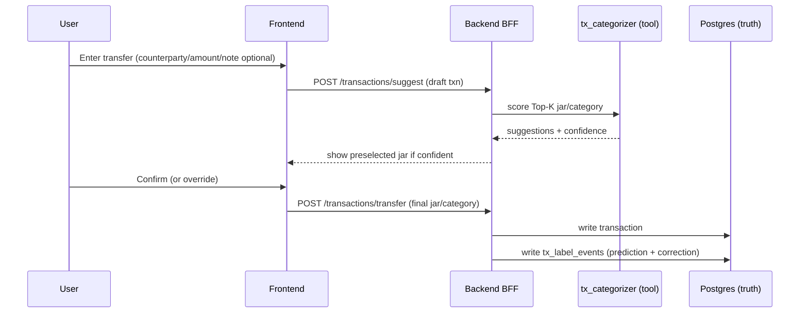

# Model + Data Training Plan (Jars MVP)

This document plans how to add trainable models to **Jars** while keeping the rule:

- **Truth layer** (numbers, balances, aggregates) comes **only** from Postgres views.
- Models provide **labels / signals** (categorization, anomaly/forecast), and the Tier2 LLM only **explains** outputs from tools/views.
- Every inference is treated as a **tool** (auditable, policy-able, versioned).

## 1) Models to add

### Core (MVP)

1) **`tx_categorizer` (Jar + Category suggester)**
   - **Job:** suggest `jar_id` + `category_id` (Top-K + confidence) for a transaction.
   - **Why it's needed:** users often leave transfer notes empty; UX still wants "1-click confirm" instead of manual browsing.
   - **Key requirement:** works even when users can create **new, custom jars** (dynamic label set).

2) **`anomaly_signal` (Tier1 alerts)**
   - **Job:** detect spend spikes, income drops, runway risk, abnormal category drift.
   - **MVP path:** start with deterministic SQL heuristics on views, then swap to ML when data grows.

### Optional (upgrade)

3) **`kb_reranker`**
   - **Job:** improve KB retrieval relevance for policy/template docs (reduce "wrong citation").

4) **`merchant_normalizer`**
   - **Job:** normalize noisy `counterparty/raw_narrative` into a canonical `merchant_id` (clustering / embeddings).

## 2) `tx_categorizer`: design that supports user-defined jars

Because jars are **user-defined**, classic multi-class classification ("choose one of N fixed labels") breaks whenever a user creates a new jar.
The robust approach is **matching/ranking**:

- Represent each user jar by a **Jar Profile** text blob.
- Score each jar against the transaction text and metadata.
- Return Top-K jar/category suggestions with calibrated confidence.

### 2.1 Inputs (minimum viable)

Even if users do not type a note, you still need *some* signal. Store/collect these fields at ingestion time:

- `counterparty` (beneficiary / payer name)
- `raw_narrative` (bank-generated transfer narrative/reference, if available)
- `user_note` (optional, user-typed)
- `direction` (debit/credit)
- `amount`, `currency`
- `occurred_at` (timestamp)
- `channel` (transfer/card/qr/cash/other, if available)

If **all text is empty/default** and only `amount/time` remain, the model must return **low confidence** and force manual selection.

### 2.2 Jar Profile (per user, per jar)

Create a jar with:
- `name` (e.g., "Ví đi chơi với người yêu")
- optional `description` (purpose in 1-2 sentences)
- optional `keywords` (merchant names, places, emojis, slang)
- optional `examples` (a few example transactions the user confirms belong to this jar)

Jar profile text used for matching:

```
Jar: {name}
Description: {description}
Keywords: {kw1, kw2, ...}
Examples: {merchant1, merchant2, ...}
```

### 2.3 Scoring + confidence gating

MVP scoring stack (fast -> accurate):

1) **Rules first (deterministic)**
   - `counterparty -> jar_id` pinned mappings (user confirms once, reuse forever)
   - keyword rules (regex/contains)

2) **Embedding retrieval (candidate generation)**
   - Embed `transaction_text` and `jar_profile_text`.
   - Top-N by cosine similarity.

3) **Cross-encoder rerank (optional, later)**
   - A small transformer that scores `(transaction_text, jar_profile_text) -> relevance`.

Confidence gating for UX:
- Autoselect only when `p_top1 >= T` **and** `(p_top1 - p_top2) >= M`
- Else show Top-K suggestions and require tap-to-confirm

## 3) Data to collect (datasets you can actually train)

Public datasets help with generic "category from description", but will not match:
- Vietnamese bank narratives
- your jar taxonomy (dynamic, user-defined)
- your product UX (confirm/correct loop)

So the most valuable dataset is **your own app telemetry** (with user consent).

### 3.1 Tables / events (recommended)

#### `jars` (add fields for ML)
- `id`, `user_id`, `name`
- `description` (text, nullable)
- `keywords` (text[], nullable) or `keywords_json` (jsonb)
- `created_at`, `updated_at`

#### `transactions` (keep raw signals)
- existing: `id`, `user_id`, `jar_id`, `category_id`, `amount`, `counterparty`, `created_at`, `direction`
- add: `raw_narrative`, `user_note`, `channel`, `currency`, `occurred_at`

#### `tx_label_events` (supervised labels + feedback loop)
Every time a user confirms/changes a suggestion, write one event:
- `id`, `user_id`, `txn_id`
- `model_version`
- `input_snapshot` (jsonb: the fields used for inference; redact if needed)
- `suggested_jar_id`, `suggested_category_id`, `scores_topk` (jsonb)
- `final_jar_id`, `final_category_id`
- `is_override` (bool)
- `created_at`

### 3.2 Derived training sets

**Pairwise ranking dataset** (best for dynamic jars):
- Positive: `(transaction, correct_jar_profile) = 1`
- Negatives: `(transaction, other_jar_profile) = 0` (sample 5-20 jars per txn)

This trains a model that can score **new jars** without changing the classifier head.

## 4) Training recipes (practical MVP -> better)

### 4.1 MVP baseline (no GPU required)
- Deterministic rules + pinned mappings
- Embedding model (off-the-shelf, no fine-tune) for candidate retrieval
- Calibrate thresholds on your own validation logs (`tx_label_events`)

### 4.2 Fine-tune option (recommended when you have data)

**Option A: Bi-encoder (embedding fine-tune)**
- Loss: contrastive / triplet
- Pros: fast inference + supports ANN index
- Cons: may need reranker for top-1 accuracy

**Option B: Cross-encoder (pair classifier)**
- Loss: binary classification on (txn_text, jar_text)
- Pros: higher accuracy on top-1
- Cons: slower; use only on Top-N candidates

### 4.3 Evaluation metrics (what matters for UX)
- `top1_accuracy`, `top3_accuracy`
- `coverage@confidence`: % autoselected at threshold T
- `override_rate`: % user changes model suggestion
- calibration (ECE), especially if you auto-apply suggestions

Split strategy:
- time-based split per user (train on older txns, validate on newer)
- also test cold-start jars (new jars with 0-3 examples)

## 5) Integration into the project (tool-first, auditable)

### 5.1 Request-time UX flow (still "tap jar", but faster)



### 5.2 Service placement

Treat `tx_categorizer` as a deployable tool:
- FastAPI/Node service (ECS/App Runner) **or** SageMaker endpoint.
- Version the model (`model_version`) and log it on every prediction.

### 5.3 Governance & audit
- Do not send raw ledger rows to the Tier2 LLM.
- Log: `trace_id`, tool name, `input_hash`, `output_hash`, `model_version`, top-k ids.
- If you route categorization via Gateway/Policy, enforce:
  - user ownership (`user_id` matches token subject)
  - deny-by-default
  - allow only minimal fields for inference (no full history unless needed)

## 6) MVP checklist (2-3 days realistic)

1) Add `POST /transactions/suggest` returning Top-K jar/category + confidence.
2) Add jar fields: `description`, `keywords` in schema (design-level is enough for MVP).
3) Start logging `tx_label_events` for every confirmation/override.
4) Start with rule-based + embedding similarity (no training).
5) After ~1-2 weeks of data, fine-tune bi-encoder or cross-encoder.

## 7) Forecast + Anomaly addendum (user total + per jar)

This section extends the plan for **forecasting** and **anomaly** beyond the rule-only MVP.

### 7.1 Dataset candidates (bootstrap only)
Public datasets help with text signals or anomaly patterns, but do **not** replace real user telemetry.
Use them to prototype pipelines, metrics, and thresholds.

**A) Text -> Category (tx_categorizer bootstrap)**
- **HF: `mitulshah/transaction-categorization`**
  - Large dataset with `transaction_description` + `category`.
  - Good for baseline text classifier / embedding retrieval.
- **HF: `utkarshugale/BusinessTransactions`**
  - Smaller dataset; good for schema mock + pipeline tests.
- **GoMask sample datasets** (Bank Transaction Categorization)
  - Very small; good for demo and smoke tests.

**B) Anomaly / pattern datasets (Tier1 signals)**
- **PaySim (Kaggle)**
  - Synthetic financial transactions with balances/time steps.
  - Useful for testing anomaly logic and end-to-end alert pipeline.
- **Optional large synthetic fraud datasets** (for scale tests)
  - Only for load testing or feature exploration; not for production advice.

> NOTE: All public datasets must be license-checked before use.

### 7.2 Forecasting targets (MVP)
Forecast is **per user total** and **per jar**:
- **User total spend forecast** (daily or weekly)
- **Jar-level spend forecast** (daily or weekly)

#### 7.2.1 Required aggregates (SQL views)
- `txn_agg_daily` with:
  - `user_id`, `date`, `spend_total`, `income_total`, `jar_spend_json`
- Optional: `jar_spend_daily` view for faster per-jar series

#### 7.2.2 Feature pack
- Base: `spend_total`, `income_total`, `jar_spend`
- Calendar features: `day_of_week`, `week_of_month`, `month`, `is_weekend`
- (Optional) domain features: `payday_flag`, `holiday_flag`

#### 7.2.3 Model path (MVP -> scale)
**MVP baseline (no GPU):**
- **Prophet** or **SARIMAX** per user total spend
- **Prophet** per jar (top N jars by activity)
- If data is sparse: fallback to **rolling average + seasonality heuristics**

**Later (when data grows):**
- **N-BEATS** for univariate series
- **TFT** for multi-horizon + multiple regressors

#### 7.2.4 Metrics + gating
- Metrics: `MAE`, `MAPE`, `coverage@confidence`
- Gating: if series length < threshold (e.g., 30 days), **skip ML** and use rules.

### 7.3 Anomaly signals (MVP)
Anomaly detection is **advisory**, not fraud.

#### 7.3.1 MVP rules (Tier1)
- Spend spike vs 30d baseline
- Income drop vs 60d baseline
- Jar drift: jar share changes above threshold
- Low balance runway (from SQL views)

#### 7.3.2 ML upgrade (when logs exist)
- **IsolationForest** or **OneClassSVM** on daily features
- Feature vector: `spend_total`, `income_total`, `jar_spend_*`, `time_since_payday`, `txn_count`
- Output is a **signal score**; still pass through rule-based gating

### 7.4 Integration (tools + audit)
- Expose as tools:
  - `forecast_user_total`
  - `forecast_jar_spend`
  - `anomaly_score_daily`
- Tool outputs are logged with:
  - `trace_id`, `model_version`, `input_hash`, `output_hash`
- Tier2 LLM only **explains** tool outputs.

### 7.5 Data flywheel (logs you must capture)
- `forecast_events` (store model outputs vs realized actuals)
- `anomaly_events` (score + rule triggers + user feedback)
- Re-train only after data volume is sufficient.

### 7.6 MVP demo suggestion
- Show 30d jar history -> show 7d forecast band
- Trigger a spike alert based on rule + show advisory explanation
- Include `trace_id` and audit entry for transparency

### 7.7 ASSUMPTIONS
- Sufficient daily aggregates exist in SQL views.
- Dataset licenses are compatible with hackathon/demo use.
- Early MVP favors rule-based + light models over heavy deep learning.
